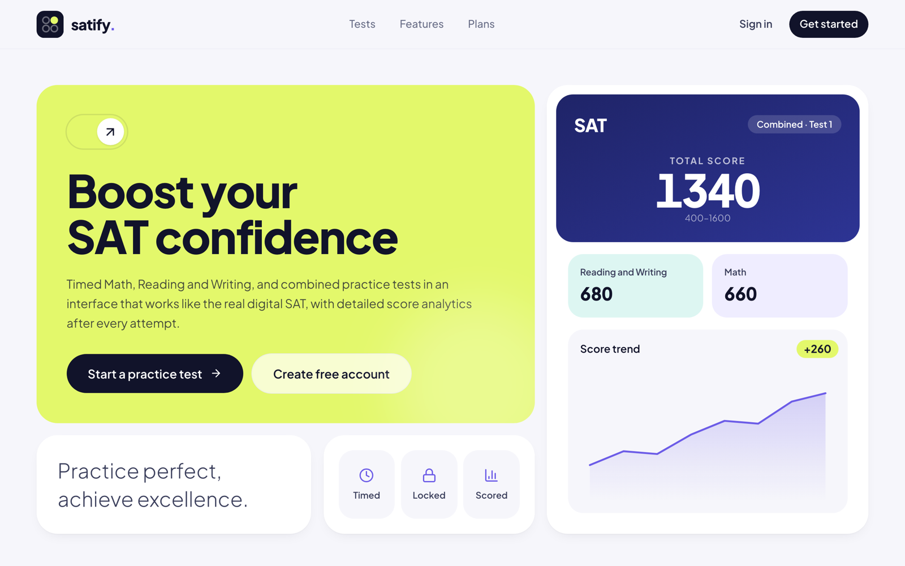
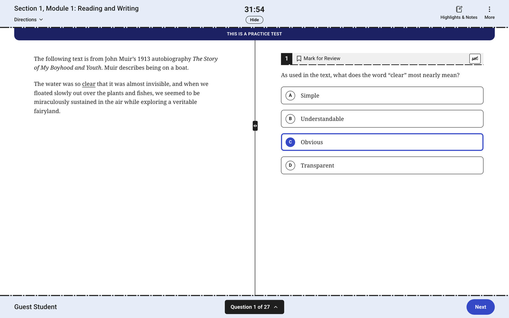
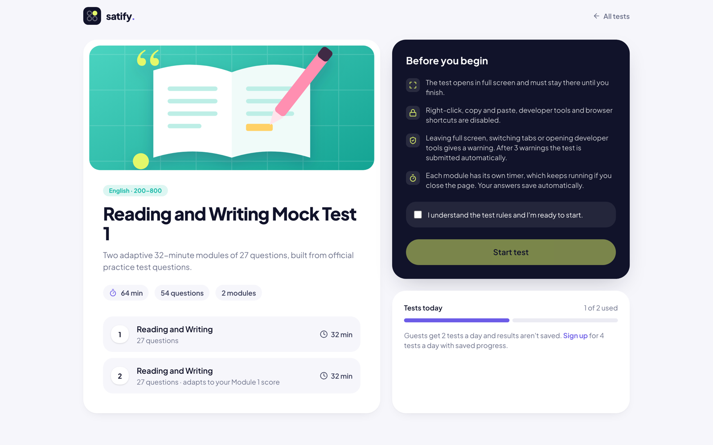
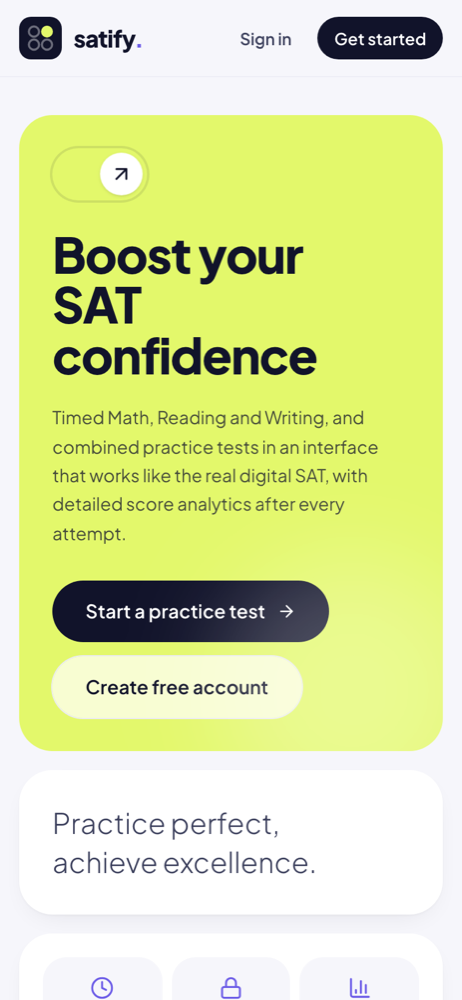
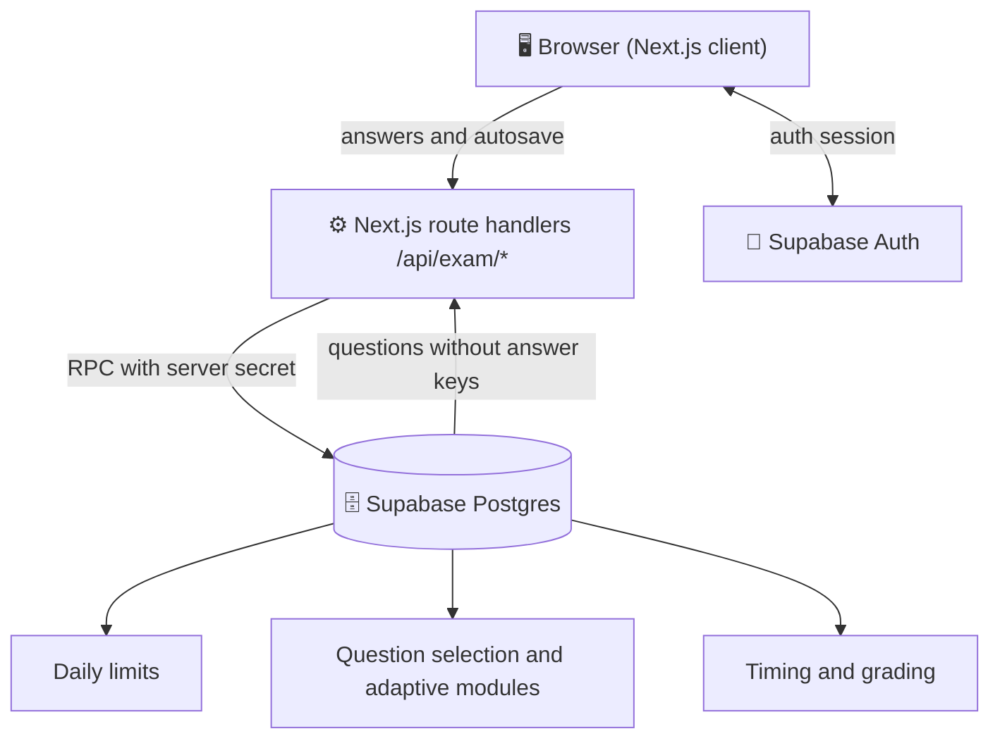

<div align="center">


# Satify

**Digital SAT practice that feels like test day.**

Full-length, timed Math and Reading & Writing tests in an interface modeled on the real
exam — with adaptive modules, exam lockdown, server-side scoring and detailed score analytics.

[**Live demo →**](https://sat-prep-drab-ten.vercel.app)




</div>

## ✨ Highlights

| | |
| --- | --- |
| 🧪 **Real exam structure** | Math (2 × 22 questions, 35 min), Reading and Writing (2 × 27 questions, 32 min) and full-length tests with a 10-minute break, scored 400–1600 |
| 🔀 **Adaptive modules** | Module 2 gets easier or harder depending on your Module 1 score, just like the digital SAT |
| 🖥️ **Familiar test interface** | Resizable passage split, answer eliminator, mark for review, question navigator, Check Your Work page, highlighter, line reader, Desmos graphing and scientific calculator (College Board edition), reference sheet |
| 🔒 **Exam lockdown** | Full screen only, copy/paste and dev-tools shortcuts blocked, tab-switch detection — 3 warnings and the test submits itself; every event is logged |
| 🛡️ **Server-side scoring** | Answer keys never reach the browser. Timing, grading and daily limits all run in Postgres |
| 📊 **Score reports** | Scaled scores, domain breakdown, skill radar, difficulty and timing charts, plus a full question review with explanations |
| 📈 **Progress dashboard** | Every attempt saved to your account with score trends over time |

## 📸 Screenshots

<table>
  <tr>
    <td width="50%"><p align="center"><sub>Test interface</sub></p></td>
    <td width="50%"><p align="center"><sub>Test lobby and rules</sub></p></td>
  </tr>
</table>

<p align="center">
  
  <br /><sub>Responsive on phones</sub>
</p>

## 🎟️ Plans

| | Guest | Free account |
| --- | :---: | :---: |
| Tests per day | **2** | **4** |
| Full test interface and tools | ✅ | ✅ |
| Score report after each test | ✅ | ✅ |
| Saved results and progress charts | — | ✅ |

Limits are enforced in the database (guests by cookie and hashed IP) and reset every day at 00:00 UTC.

## 🏗️ How it works



- The browser only ever receives question content — never the answers.
- Route handlers call security-definer Postgres functions with a server secret, so the
  exam engine can't be driven directly from the client.
- Row Level Security keeps each student's attempts private.

## 🧰 Tech stack

**Next.js 16** (App Router) · **React 19** · **TypeScript** · **Tailwind CSS 4** ·
**Supabase** (Postgres, Auth, RLS, Storage) · **Recharts** · **KaTeX** · **Zod** · **Vercel**

## 🚀 Getting started

```bash
git clone https://github.com/mahmudulashev/sat-prep.git
cd sat-prep
npm install
cp .env.example .env.local   # fill in the values
npm run dev
```

Open http://localhost:3000.

### Database

1. Create a Supabase project and run the files in `supabase/migrations` in order.
2. Generate a server secret and store its SHA-256 hash in the database:

   ```bash
   openssl rand -hex 32            # -> EXAM_SERVER_SECRET in .env.local
   printf %s "<secret>" | shasum -a 256
   ```

   ```sql
   insert into private.config (key, value) values ('server_secret_sha256', '<hash>');
   ```

3. Load the sample questions:

   ```bash
   npm run seed -- --push
   ```

4. Configure Supabase Auth (Dashboard → Authentication):
   - **Emails**: Supabase's built-in email service only delivers to your project's team
     members. For real sign-ups, add a custom SMTP provider (Resend, Postmark, SES…) or
     turn off *Confirm email* under Sign In / Providers → Email.
   - **URL Configuration**: set the Site URL to your domain and add
     `https://<your-domain>/auth/callback` to the redirect URLs.
   - **Password security**: enable leaked password protection.

Sample questions live in `content/questions/*.ts` and test forms in `content/tests.ts`.
`npm run seed` validates them and regenerates `supabase/seed.sql`.

### Official practice content (optional)

Official College Board practice tests and question bank PDFs go in `SATBOOKS/` and
`QUESTIONS BANK/` (both git-ignored and not included in this repository). To extract and
upload them:

```bash
python3 -m pip install pymupdf        # once
npm run extract:official              # writes content/official/ (git-ignored)
npm run seed:official                 # uploads questions, tests and images to Supabase
npm run upload:images                 # copies images to the Storage CDN (NEXT_PUBLIC_ASSET_BASE)
```

`upload:images` writes to the public `question-images` bucket, which has no public
upload policy: add `SUPABASE_SECRET_KEY` to `.env.local` before running it.

Reading and Writing questions are stored as text (with tables and graphs as images);
Math questions are stored as images cropped from the PDFs.

## 📜 Scripts

| Command | Description |
| --- | --- |
| `npm run dev` | Start the dev server |
| `npm run build` | Production build |
| `npm run lint` | ESLint |
| `npm run typecheck` | TypeScript |
| `npm run seed` | Validate sample content and write `supabase/seed.sql` (`-- --push` uploads it) |
| `npm run extract:official` | Extract official practice content from the PDFs |
| `npm run seed:official` | Upload official content to Supabase |
| `npm run upload:images` | Copy question images to Supabase Storage |

## 📁 Project structure

```
src/
  app/            routes: landing, auth, dashboard, exam, results, API handlers
  components/     exam runner, charts, dashboard, marketing and UI components
  lib/            Supabase clients, exam engine client, helpers
content/          sample questions and test forms
supabase/         SQL migrations and seed
scripts/          content seeding and official-content extraction
```

## 📝 Notes

- Browsers don't allow a website to fully disable developer tools or prevent leaving
  full screen. The lockdown detects and records these actions, warns the student and
  submits the test after repeated violations; answers are graded on the server so
  inspecting the page reveals nothing useful.
- Full screen is required in production builds; development builds continue without
  it when the browser refuses (for example inside embedded previews).

## 👤 Author

Made by **Mahmud Ulashev** — [Telegram](https://t.me/mahmud_ulashev) · [GitHub](https://github.com/mahmudulashev)

<sub>SAT is a trademark of the College Board, which is not affiliated with and does not endorse this project.</sub>
